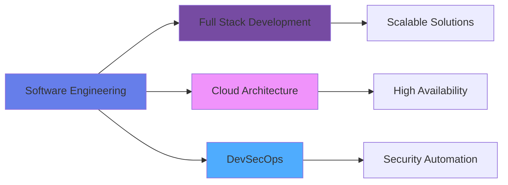

<div align="center">

# Josué Alejandro Pérez

**`Ingeniero en Ciencias y Sistemas`** | **`Full Stack Developer`** | **`Cloud & Security Specialist`**

[](https://www.linkedin.com/in/alejandropérez98)
[](mailto:japb1998@yahoo.com)
[](https://wa.me/50256276439)

</div>

---

## 📋 Resumen Profesional

Ingeniero egresado de la **Universidad de San Carlos de Guatemala** con especialización en el ciclo de vida de desarrollo de software seguro y arquitecturas en la nube. Experto en la implementación de soluciones escalables bajo metodologías ágiles y estándares internacionales de ciberseguridad.

Profesional con enfoque técnico en la convergencia de desarrollo moderno y seguridad operativa. Experiencia en la gestión de infraestructuras críticas y optimización de flujos de trabajo mediante la automatización y el uso de marcos de trabajo estructurados.

### Perfil Académico y Metodológico

```yaml
Formación:      Ingeniería en Ciencias y Sistemas (USAC)
Metodologías:   Scrum, Kanban, GitFlow, DevSecOps
Idiomas:        Español (Nativo), Inglés B1 (Intermedio profesional)
Enfoque:        Clean Code, SOLID, Design Patterns, Security by Design
```

---

## 🛠️ Stack Tecnológico

<table>
<tr>
<td width="50%" valign="top">

### Desarrollo de Software
```typescript
const skills = {
  backend: ['Node.js', 'Express', 'Java', 'Python', 'Go'],
  frontend: ['React', 'Next.js', 'TypeScript'],
  architecture: ['REST APIs', 'Microservices', 'Event-Driven'],
  testing: ['Jest', 'Mocha', 'Unit Testing', 'Integration Testing']
}
```

</td>
<td width="50%" valign="top">

### Infraestructura & DevOps
```yaml
Cloud:
  - Amazon Web Services (AWS)
  - Google Cloud Platform (GCP)
  - Microsoft Azure

DevOps:
  - Docker & Kubernetes
  - Terraform (IaC)
  - CI/CD Pipelines
  - Jenkins, GitHub Actions
```

</td>
</tr>
<tr>
<td width="50%" valign="top">

### Seguridad & Compliance
```python
security_expertise = [
    "OWASP Top 10",
    "DevSecOps Practices",
    "Vulnerability Assessment",
    "Secure SDLC",
    "Network Security"
]
```

</td>
<td width="50%" valign="top">

### Gestión de Datos
```sql
-- Bases de Datos
SELECT technology FROM databases
WHERE expertise IN (
  'PostgreSQL',
  'MongoDB',
  'Redis',
  'MySQL'
)
```

</td>
</tr>
</table>

---

## 🎓 Certificaciones Profesionales

<div align="center">

### 🏆 Coderhouse - Top 10 Académico Nacional

<table>
<tr>
<td align="center" width="33%">

**Full Stack Development**

Arquitectura completa de aplicaciones web modernas

[Ver Certificado →](https://www.coderhouse.com/latam/certificados/64e3b204a1991eea8ce3db04?lang=es)

</td>
<td align="center" width="33%">

**Backend Development**

Desarrollo de APIs escalables y seguras

[Ver Certificado →](https://www.coderhouse.com/latam/certificados/64e3b204a1991e3ce1e3db02?lang=es)

</td>
<td align="center" width="33%">

**Frontend Development**

Interfaces modernas y responsivas

[Ver Certificado →](https://www.coderhouse.com/latam/certificados/63f94f49ddb983000e1b6338?lang=es)

</td>
</tr>
</table>

### Certificaciones Complementarias

| Área | Certificación |
|:-----|:--------------|
| 🔐 Seguridad | Fundamentos de Ciberseguridad |
| ☁️ Cloud | Arquitectura Cloud Computing |
| 🌐 Idiomas | Inglés B1 - Intermedio Profesional |

</div>

---

## 💼 Áreas de Especialización

<div align="center">



</div>

### Dominios Técnicos

| Dominio | Aplicación Práctica |
|:--------|:-------------------|
| **Arquitectura de Software** | Diseño de sistemas distribuidos y microservicios con patrones de alta cohesión y bajo acoplamiento |
| **Cloud Native Development** | Implementación de soluciones serverless y containerizadas en entornos multi-cloud |
| **Security Engineering** | Integración de controles de seguridad en todas las fases del SDLC (Shift-Left Security) |
| **Infrastructure as Code** | Automatización de infraestructura mediante Terraform y scripts de aprovisionamiento |
| **Performance Optimization** | Análisis y mejora de rendimiento en aplicaciones de alto tráfico |

---

## 🚀 Proyectos de Ingeniería Destacados

### Proyecto 1: Sistema de Microservicios con Seguridad Integrada
```
📦 Stack: Node.js, Docker, Kubernetes, AWS ECS, PostgreSQL
🔒 Security: OWASP compliance, JWT authentication, Rate limiting
📊 Impact: Reducción del 40% en tiempo de deployment, 99.9% uptime
```

**Características Técnicas:**
- Arquitectura de microservicios con service mesh
- CI/CD automatizado con pruebas de seguridad integradas
- Monitoreo en tiempo real con métricas personalizadas
- Escalamiento automático basado en métricas de negocio

---

### Proyecto 2: Plataforma Cloud de Alta Disponibilidad
```
☁️ Stack: AWS (Lambda, API Gateway, DynamoDB), Terraform
⚡ Performance: Sub-100ms latency, auto-scaling
💰 Optimization: Reducción de costos del 35% mediante arquitectura serverless
```

**Logros Clave:**
- Implementación de multi-región con failover automático
- Optimización de costos mediante análisis de uso y rightsizing
- Documentación técnica completa y runbooks operacionales
- Cumplimiento de estándares de seguridad ISO 27001

---

### Proyecto 3: Pipeline DevSecOps Empresarial
```
🔧 Stack: Jenkins, SonarQube, OWASP ZAP, Docker, Kubernetes
🛡️ Security: Automated vulnerability scanning, SAST/DAST
📈 Results: 60% reducción en vulnerabilidades detectadas en producción
```

**Implementación:**
- Pipeline completamente automatizado desde commit hasta producción
- Análisis estático y dinámico de código integrado
- Gates de calidad y seguridad con políticas personalizadas
- Trazabilidad completa de cambios y auditoría

---

## 📊 Enfoque de Trabajo

<div align="center">

| Principio | Aplicación |
|:---------:|:-----------|
| **Clean Code** | Código legible, mantenible y bien documentado siguiendo convenciones de la industria |
| **Test-Driven** | Cobertura de pruebas >80%, TDD para funcionalidades críticas |
| **Agile Mindset** | Entregas iterativas, retrospectivas continuas, mejora constante |
| **Security First** | Threat modeling, security reviews, y principle of least privilege |
| **Documentation** | Technical specs, API docs, architecture decision records (ADR) |

</div>

---

## 🎯 Áreas de Interés Actual

<table>
<tr>
<td width="50%">

**Desarrollo Técnico**
- Arquitecturas serverless avanzadas
- Event-driven microservices
- React Native para aplicaciones móviles
- GraphQL y API Gateway patterns

</td>
<td width="50%">

**Investigación y Aprendizaje**
- Machine Learning en producción
- Kubernetes operators y custom resources
- Zero-trust security architecture
- Site Reliability Engineering (SRE)

</td>
</tr>
</table>

---

## 📞 Contacto Profesional

<div align="center">

¿Interesado en colaborar o discutir oportunidades? Siempre abierto a conversaciones sobre proyectos innovadores, arquitectura de software y mejores prácticas de ingeniería.

| Canal | Información |
|:------|:------------|
| 💼 LinkedIn | [linkedin.com/in/alejandropérez98](https://www.linkedin.com/in/alejandropérez98) |
| 📧 Email | japb1998@yahoo.com |
| 💬 WhatsApp | [+502 5627 6439](https://wa.me/50256276439) |
| 🐦 Twitter/X | [@alejo181298](https://x.com/alejo181298) |
| 📍 Ubicación | Guatemala City, Guatemala |

</div>

---

<div align="center">

### 💡 Áreas de Colaboración

**`Software Architecture`** • **`Cloud Solutions`** • **`DevSecOps`** • **`Technical Leadership`** • **`Mentorship`**

---

**Ingeniero Josué Alejandro Pérez**  
*Systems Engineer | Building secure, scalable, and efficient software solutions*


</div>
